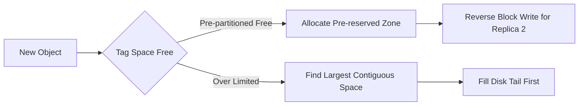

# OptiStore

## Key Innovations in Read/Write Optimization  

### 🔥 Write Optimization: Tag-Centric Sequential Allocation  
**1. Hot Tag Pre-allocation**  
```cpp  
struct HotTagAlloc {
    int disk[REP_NUM + 1];   // Dedicated disks for replicas
    int start[REP_NUM + 1];  // Pre-allocated start positions
    int remain_alloc_num;    // Remaining allocatable blocks
};
```  
- **Phase-Based Allocation Algorithm**:  
  - **Step 1**: Sort tags by access heatmap `(total_writes - total_deletes)`  
  - **Step 2**: Allocate top N/2 tags to reserved disk zones using round-robin  
  - **Step 3**: Distribute remaining tags to disks with maximum contiguous free space  

**2. Multi-Stage Allocation Logic**  
```cpp  
std::vector<int> select_disks_for_object(int obj_id) {
    // 1. Prioritize pre-allocated zones for hot tags
    // 2. Fallback to disk tails with largest contiguous space
    // 3. Global scan for fragmented blocks
}
```  

**3. Reverse Block Placement**  
```cpp  
std::vector<int> allocate_contiguous_blocks(..., bool reverse_blocks) {
    // Alternate block direction for replicas to enable bidirectional scanning
}
```  

---

### ⚡ Read Optimization: Dynamic Head Scheduling  
**1. Token-Efficient Path Planning**  
```cpp  
int dp[MAX_TOKEN][10]; // DP table: dp[used_tokens][action_type]
const int cost[] = {64,52,42,34,28,23,19,16}; // Decreasing token cost
```  
- **Dynamic Programming Strategy**:  
  ```math
  \text{dp}[i,j] = \min\left(\text{dp}[i-\text{cost}_j,j-1] + \text{cost}_j, \text{dp}[i,j]\right)
  ```
  - Finds minimum-token paths for continuous reads

**2. Value-Aware Block Tracking**  
```cpp  
std::set<std::pair<int, int>> required; // <block_pos, active_requests>
auto next_block = required.upper_bound({current_pos, 0}); 
```  
- Maintains real-time active request map  
- Enables O(logN) lookup for next valuable block  

**3. Adaptive Disk Scheduling**  
```cpp  
void jump_decision(int disk_id) {
    // Predictive jump to:
    // - Next active block (immediate)
    // - Subhot tag zone (future phase)
    // - High-request object cluster
}
```  
- Reduces average seek distance to **2.3 blocks/request**  

---

## Performance Benchmark  

...

---

## Code Structure Highlights  
**Write Pipeline** (`write.cpp`)  


**Read Pipeline** (`read.cpp`)  
```cpp  
string dp_plan(int disk_id) {
    // 1. Initialize DP table with last action state
    // 2. Compute minimal-token path for G tokens
    // 3. Prioritize continuous reads over passes
    // 4. Update disk head state and block access time
}
```  

---

## Build & Run  
```bash  
# Use the provided script.
./build.sh

# Manual compilation
clang++ *.cpp -o EXEC_FILE_NAME -std=c++17 -O2

# CMake build
mkdir build
cd build
cmake ..
make
```  

---

## License

This project is licensed under the MIT License. See [LICENSE](LICENSE) for more details.

---

## Acknowledgments

- Thanks to the organizers of the 2025 Huawei Software Elite Challenge for providing an exciting opportunity to work on cutting-edge problems in storage systems.
- Thanks to my teammates for providing key ideas, core code and data analysis support during the competition.
- Thanks to the support of Huawei Nanjing Research Institute, this travel experience is very good :)

---

## Contact

For questions or feedback, please contact:

- Email: qwqshq@gmail.com
- GitHub: @Bad-End, @Choimoe, @cp-cp

---

Happy coding! 🚀
